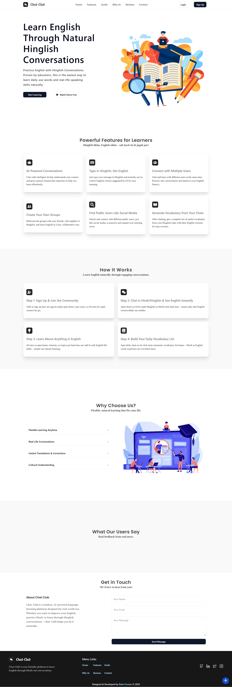

# 🧠ChatClub – Learn English Through Daily Conversations

🚧 **Project is currently under active development.**

**ChatClub** is a smart, chat-based English learning platform built with the **MERN stack** (MongoDB, Express, React, Node.js), **Socket.io**, and powered by **Gemini AI** and **Google Translate**.  
It helps users improve their English naturally by chatting in Hinglish with friends and seeing real-time English translations — just like chatting on WhatsApp or Telegram, but with built-in English learning!

---

## 🎯 Project Goal

ChatClub aims to **teach English through your daily Hinglish chats** — no boring lectures, just natural chatting and smart learning.

---

## 💡 How It Works

- 🗨️ **User chats with friends in Hinglish**
- 📜 Each message is **instantly translated into English** (smartly + formally)
- 🔄 Both versions (Hinglish + English) are visible during chat
- 🧠 Over time, user naturally **remembers English phrases**
- 🗣️ Chat messages can be **replayed as voice** (AI roleplay with friend-style voice)
- 📚 Important chats can be saved as **roleplay conversations**
- 🧾 Users can **summarize any chat** and extract key **vocabulary words**
- 📕 Vocabulary is saved in a **personal vocabulary bank** (with Hindi meanings)

---

## 🚀 Core Features – v1

> The following features will be available in the first version:

- ✅ Real-time chat system using **Socket.io**
- ✅ Gemini API for smart English translation
- ✅ Hinglish to English translation in real-time
- ✅ Save & replay chat roleplay with voice (AI-based)
- ✅ Extract vocabulary from chat
- ✅ Personal vocabulary storage with Hindi meaning
- ✅ Google login (OAuth) with secure JWT & cookie handling
- ✅ Basic landing page (temporary)
- ❌ Mobile app & admin panel (planned for future)

---

## 🧠 Tech Stack

- **Frontend:** React.js + Tailwind CSS + Shadcn/UI
- **Backend:** Express.js + Node.js + MongoDB
- **Real-time:** Socket.io
- **AI Services:** Gemini API (by Google) + Google Translate
- **Auth:** Google OAuth 2.0 + Passport.js + JWT
- **Voice/Audio:** (Planned) Text-to-Speech API

---

### 🚀 Made with 💖 by [Rahul Kumar](https://github.com/rahulydw)
